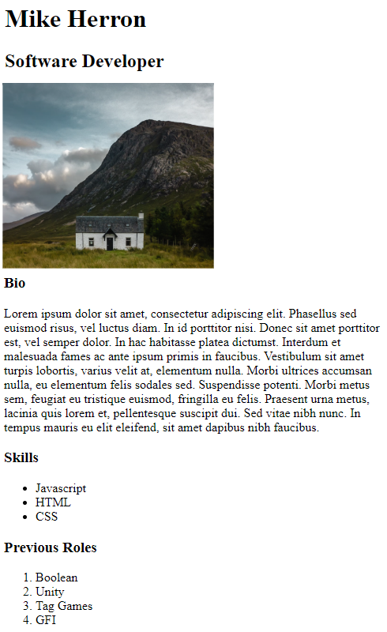

# HTML Profile
We're going to build a simple profile page using HTML.

## Instructions
Create a simple profile page, similar to the content below using HTML:

The `index.html` file contains an initial HTML template you can use to get started. You should make sure your page has the following elements:

* Two different types of heading
* At least one paragraph
* An ordered list 
* An unordered list
* An image
* Use `div`s to create at least 2 different sections 
